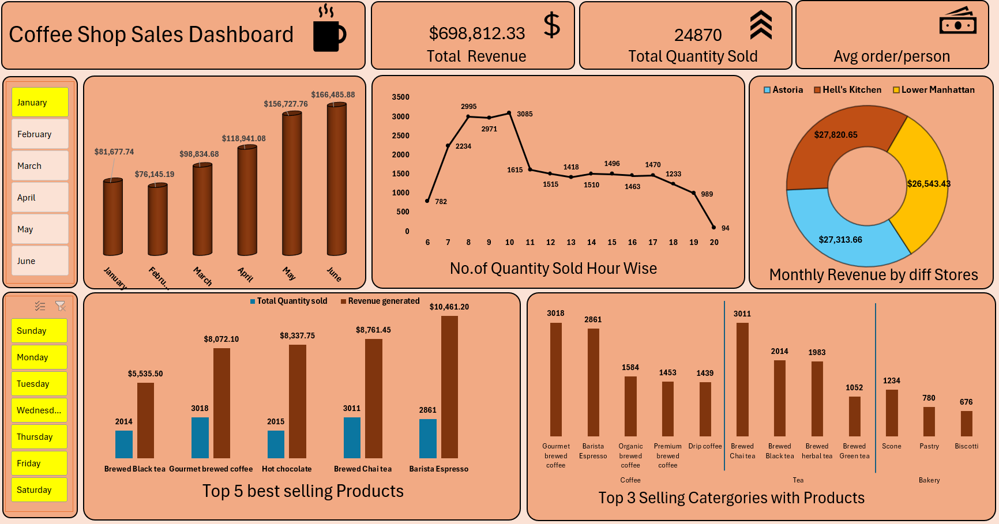

# Coffee-Shop-Sales-Dashboard

## 📌 Project Overview

This Excel-based Coffee Shop Sales Dashboard project analyzes retail sales data to extract key business insights and performance indicators. The goal is to visualize sales trends, identify peak hours, track product and category performance, and monitor monthly revenue generation across different store locations. This dashboard enables quick, data-driven decision-making for improving business strategies and customer service in a coffee shop setting.

---

## 📊 KPIs Tracked

✅ Total Revenue

✅ Total Quantity Sold

✅ Average Order/Person

✅ Monthly Revenue (Jan–June)

✅ Hourly Quantity Sold Trend

✅ Monthly Revenue by Store Location

✅ Top 5 Best-Selling Products (Quantity & Revenue)

✅ Sales by Weekday

---
## 📌 Process Used in Project

#### 1. **Raw Data Issues Identified**

* `transaction_time` was stored as **text** instead of time format.
* No calculated **revenue** column (needed to be derived using `unit_price × transaction_qty`).

#### 2. **Data Cleaning Steps**

* ✅ Converted `transaction_time` to proper **time format** and extracted **hour** for time-based analysis.
* ✅ Created new column **Total\_Revenue** = `unit_price × transaction_qty`.
* ✅ Ensured all date columns were in **datetime** format for compatibility with slicers and pivot timelines.
* ✅ Standardized text formatting in `store_location`, `product_category`, and `product_detail`.

---

#### 3. **Data Transformation & Aggregation**

* 📊 Aggregated total revenue and total quantity:

  * **Per month** (for trend analysis).
  * **By store** (for location-wise performance).
  * **By product and category** (for sales performance).
  *  Extracted hour from `transaction_time` to create "Sales by Hour" line chart.
  *  Extracted weekday from `transaction_date` for "Sales by Weekday" breakdown.

---

## 🧰 Excel Features Used

📌 Pivot Tables – For summarizing revenue, quantity sold, and category analysis.

📌 Pivot Charts – To create dynamic visualizations (bar, line, and donut charts).

📌 Slicers – To filter data by month and day of the week.

📌 Timelines – For date-based filtering (if implemented).

📌 Conditional Formatting – Highlighted key metrics or values.

📌 Custom Cell Formatting – For currency, number format, and visual appeal.

📌 Formulas – Used for calculated fields like average order/person

---

